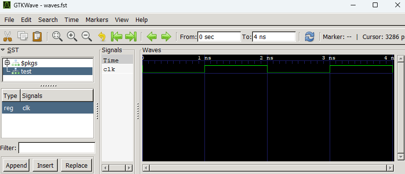

[某RTL界隈で話題沸騰中のVerilog simulator](https://x.com/taichi600730/status/1788228372910505988 )、Altair DSimを試しに使ってみるテスト。趣味で無料で使えるシミュレータの中では、これが現状最強な気がする。

## DSimの特徴
- 個人向けの1ジョブ限定の無償ライセンスが利用可能。
- 追加の有償ライセンスなしでSystemVerilogのすべての機能が利用可能。
    - SystemVerilog assertion (SVA)
    - User-defined nettype (UDN)
    - UVM (UVM-1.1b, UVM-1.1d, UVM-1.2, and UVM-2020.3.1) [^uvm]

[^uvm]:
    [How To: Use UVM in DSim](https://help.metrics.ca/support/solutions/articles/154000154925-how-to-use-uvm-in-dsim):
    _"DSim comes with UVM-1.1b, UVM-1.1d, UVM-1.2, and UVM-2020.3.1"_

## 他のシミュレータとの比較

|  | DSim | Questa[^questa] | Icarus Verilog |
|--|--|--|--|
| SVA | ✔ OK | ✔ OK | ❌ 即時アサーションのみ対応 |
| UVM | ✔ OK | ✔ OK | ❌ 非対応 |
| 制約付きランダム[^crv] | ✔ OK | ❌ `svverification`が必要  | ❌ 非対応 |
| UDN | ✔ OK | ❌ `svrnm`が必要 | ❌ 非対応 |
| ライセンス更新 | ❌ 90日ごと | ❌ 1年ごと | ✔ なし |


[^questa]:
    無償版の名称は、Questa-Intel FPGA Starter Editionです。
[^crv]:
    Constraint Random Verification (CRV)


## 環境変数の設定とシミュレーションの実行

DSimのインストール時、`DSIM_LICENSE`や`DSIM_HOME`、`PATH`などの環境変数は自動で設定されません。したがって、これらの環境変数を設定してからシミュレーションを開始する必要があります。DSimのインストール先に、そのためのBATファイル`shell_activate.bat`が用意されているので、これを利用してシミュレーションを実行するスクリプトを書きます。

```dosbatch title="run.bat"
@echo off
set "DSIM_LICENSE=\Path\To\dsim-license.json"
cd "C:\Program Files\Altair\DSim\2025.1"
call shell_activate.bat
cd %~dp0
dsim -f options.txt
pause
exit
```

```title="options.txt"
+acc
-waves waves.vcd
test.sv
```

DSimでは`*.mxd`という独自形式で波形を保存できますが、DSimの波形ビューワーがreal変数のアナログ表示に対応しておらずちょっと不便です。そのため、波形ファイルを`*.vcd`で保存し、GTKWaveを使って結果を確認することにします。ただし、VCD形式のままだとシミュレーションが長くなったときに波形表示が重くなるので、VCD形式をFST形式に変換してからGTKWaveで開くようにします。

```dosbatch title="gtkwave.bat"
@echo off
set vcd2fst="Path\To\gtkwave64\bin\vcd2fst.exe"
set gtkwave="Path\To\gtkwave64\bin\gtkwave.exe"
cd %~dp0
if exist waves.vcd (
  echo VCD2FST
  %vcd2fst% waves.vcd waves.fst
  del waves.vcd
)
%gtkwave% waves.fst
exit
```


## 動作確認用の簡単なテストベンチ

```SystemVerilog title="test.sv"
module test;
  timeunit 1ns;
  timeprecision 1ps;

  bit clk;

  initial begin
    $monitor("clk = %0b", clk);
    repeat(4) begin
      #1ns;
      clk = ~clk;
    end
    $finish();
  end
  
endmodule
```

## 実行結果



```
=S:Begin run-time elaboration and static initialization...
=N:[dumpVCD] preparing VCD dump to 'waves.vcd'.
=N:[dump] Dump started at time 0
=N:Starting event scheduler...
clk = 0
clk = 1
clk = 0
clk = 1
=T:Simulation terminated by $finish at time 4000 (test.sv:13);
```