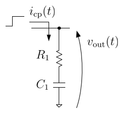
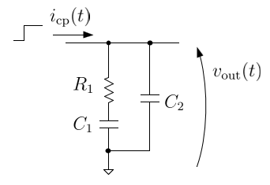

CPPLLで使われるリードラグフィルタについて、ステップ電流入力に対する出力電圧の厳密解を求めてみるテスト。あとでCPPLLモデルの高速化につなげるための仕込み。

## First-order

{:.center}

$$
\begin{align}
v_{\rm out}(t)
= R_1 I_{\rm cp} + \frac{I_{\rm cp}}{C_1}t + v_{C1}(0)
\end{align}
$$

## Second-order

{:.center}

直列RC側に注目すると、

$$
\begin{align}
v_{\rm out}(t)
= R_1 i_1(t) + \frac{1}{C_1}\int i_1(t)\,{\rm d}t
\end{align}
$$

両辺を時間で微分して、

$$
\begin{align}
\frac{{\rm d} v_{\rm out}}{{\rm d}t}
&= R_1 \frac{{\rm d} i_1}{{\rm d}t} + \frac{i_1}{C_1} \nonumber\\
&= R_1 \frac{{\rm d}}{{\rm d}t} \left(i_{\rm cp} - C_2\frac{{\rm d} v_{\rm out}}{{\rm d}t}\right)
  + \frac{1}{C_1} \left(i_{\rm cp} - C_2\frac{{\rm d} v_{\rm out}}{{\rm d}t}\right) \nonumber\\
&= R_1 \frac{{\rm d} i_{\rm cp}}{{\rm d}t}
  - R_1 C_2 \frac{{\rm d}^2 v_{\rm out}}{{\rm d}t^2}
  + \frac{i_{\rm cp}}{C_1}
  - \frac{C_2}{C_1} \frac{{\rm d} v_{\rm out}}{{\rm d}t}
\end{align}
$$

$i_{\rm cp}(t)=I_{\rm cp}$であり、その時間微分はゼロになるので、

$$
\begin{align}
R_1 C_1 C_2\frac{{\rm d}^2 v_{\rm out}}{{\rm d}t^2}
+ (C_1 + C_2)\frac{{\rm d} v_{\rm out}}{{\rm d}t}
= I_{\rm cp}
\end{align}
$$

特殊解を$v_{\rm p}(t) = At$と仮定し、微分方程式に代入すると、

$$
\begin{align}
(C_1 + C_2) A = I_{\rm cp}
\end{align}
$$

したがって、特殊解は、

$$
\begin{align}
v_{\rm p}(t) = \frac{I_{\rm cp}}{C_1 + C_2}t
\end{align}
$$

同次方程式の特性方程式と特性根は、

$$
\begin{align}
&R_1 C_1 C_2 \lambda^2 + (C_1 + C_2) \lambda = 0\\
&\therefore \lambda \left(\lambda + \frac{C_1 + C_2}{R_1 C_1 C_2}\right) = 0\\
&\therefore \lambda_1 = 0,\,\lambda_2 = \frac{C_1 + C_2}{R_1 C_1 C_2}
\end{align}
$$

したがって、一般解は係数$K_1,\,K_2$と、時定数$\tau = \dfrac{R_1 C_1 C_2}{C_1 + C_2}$を使って、

$$
\begin{align}
v_{\rm h}(t)
&= K_1 e^{-\lambda_1 t} + K_2 e^{-\lambda_1 t} \nonumber\\
&= K_1 + K_2 e^{-t/\tau}\\
\end{align}
$$

厳密解は、特殊解と一般解の和で表せるので、

$$
\begin{align}
v_{\rm out}(t)
&= v_{\rm p}(t) + v_{\rm h}(t) \nonumber\\
&= \frac{I_{\rm cp}}{C_1 + C_2}t + (K_1 + K_2 e^{-t/\tau})
\end{align}
$$

初期条件は、

$$
\begin{align}
v_{\rm out}(0) = v_{C2}(0)
\end{align}
$$

$$
\begin{align}
\frac{{\rm d}v_{\rm out}}{{\rm d}t}\bigg|_{t=0}
&= \frac{1}{C_2} (I_{\rm cp} - i_1(0)) \nonumber\\
&= \frac{1}{C_2} \left(I_{\rm cp} - \frac{v_{C2}(0) - v_{C1}(0)}{R_1}\right)
\end{align}
$$

これらから係数$K_1,\,K_2$を求めると、最終的に、

$$
\begin{align}
&K_1 = \frac{C_1 v_{C1}(0) + C_2 v_{C2}(0)}{C_1 + C_2} + I_{\rm cp} R_1 \left(\frac{C_1}{C_1 + C_2}\right)^2\\
&K_2 = \frac{C_1 (v_{C2}(0) - v_{C1}(0))}{C_1 + C_2} - I_{\rm cp} R_1 \left(\frac{C_1}{C_1 + C_2}\right)^2
\end{align}
$$

したがって、厳密解は、

$$
\begin{align}
v_{\rm out}(t)
&= \frac{I_{\rm cp}}{C_1 + C_2}t
  + \frac{C_1 v_{C1}(0) + C_2 v_{C2}(0)}{C_1 + C_2}
  + I_{\rm cp} R_1 \left(\frac{C_1}{C_1 + C_2}\right)^2 \nonumber\\
&\quad
  + \left\{
    \frac{C_1 (v_{C2}(0) - v_{C1}(0))}{C_1 + C_2}
    - I_{\rm cp} R_1 \left(\frac{C_1}{C_1 + C_2}\right)^2
  \right\} e^{-t/\tau}
\end{align}
$$

