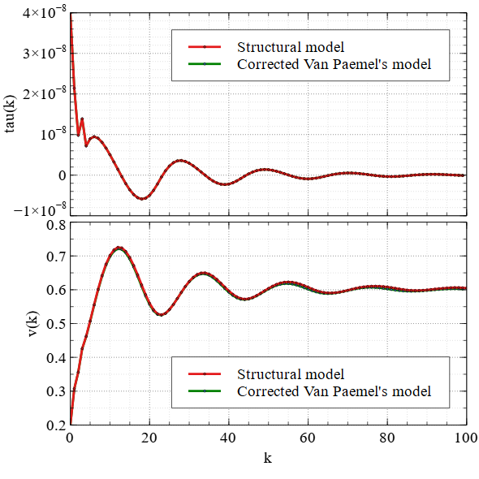
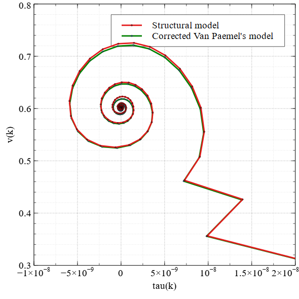

Kuznetsov N.V.が2019年に発表した、[Van Paemelの2次CPPLLモデルの問題点の修正に関する論文](https://arxiv.org/abs/1810.02609)の式が、本当に2次CPPLLの動作を正確に表現できているのか確認してみるテスト。赤線が一般的なCPPLLの構造モデル、緑線が論文の提示している数式モデルです。赤線と緑線が一致しているので、なんとなく大丈夫そう。

!!! note "Note"

    軌道がぐるんぐるんしてたほうが見ててたのしいので、位相余裕ガン無視な定数にしてます。

## 比較結果

=== "tau(k) and v(k)"
    
=== "Trajectory on tau-v plane"
    

## 実行スクリプト

=== "run.bat"

    ```dosbatch
    @echo off
    set "DSIM_LICENSE=\Path\To\dsim-license.json"
    cd "C:\Program Files\Altair\DSim\2025.1"
    call shell_activate.bat
    cd %~dp0
    dsim -f options.txt
    pause
    exit
    ```

=== "options.txt"

    ```
    -waves waves.vcd
    test_st.sv
    test_eq.sv
    ```

## 2次CPPLLモデル

=== "Corrected Van Paemel model"

    ```SystemVerilog
    module test_eq #(
      parameter real Fref = 0.1e9,
      parameter real Kvco = 1.8e9,
      parameter real Fmin = 0.1e9,
      parameter real Vmin = 0.1,
      parameter real Icp = 50e-6,
      parameter real R1 = 1e3,
      parameter real C1 = 10e-12,
      parameter int Ndiv = 10,
      parameter real Tau0 = 3.991e-08,
      parameter real V0 = 1.996e-01
    );
      timeunit 1ns;
      timeprecision 1ps;

      const real Tref = 1/Fref;

      real tau, v;
      real a, b, c, d;
      real slk, sla;
      real lb;
      real fvco;
      real keff;

      let fmod(a, b) = (a - b*$floor(a/b));

      initial begin

        integer fh;
        fh = $fopen("tau_eq.csv", "w");
        $fdisplay(fh, "k,tau,v");

        tau = Tau0;
        v = V0;

        for (int k = 0; k < 100; k++) begin
          $fdisplay(fh, "%0d,%.4e,%.4e", k, tau, v);

          if (v < Vmin) begin
            fvco = Fmin;
            keff = 0.0;
          end else begin
            fvco = Fmin + Kvco * (v - Vmin);
            keff = Kvco;
          end

          a = keff*Icp / (2*C1);
          b = fvco + keff*Icp*R1;
          c = (Tref - fmod(tau, Tref))*fvco - Ndiv;
          slk = -(fvco - keff*Icp*R1)*tau + (keff*Icp / (2*C1))*(tau**2);
          sla = fmod(slk, Ndiv);
          lb = (Ndiv - sla) / fvco;
          d = sla + Tref*fvco - Ndiv;

          if (tau >= 0) begin
            if (c <= 0 && a != 0) begin
              tau = (-b + $sqrt(b**2 - 4*a*c)) / (2*a);
            end else begin
              tau = Ndiv / fvco - Tref + fmod(tau, Tref);
            end
          end else begin
            if (lb > Tref && a != 0) begin
              tau = (-b + $sqrt(b**2 - 4*a*d)) / (2*a);
            end else begin
              tau = lb - Tref;
            end
          end

          v += (Icp/C1)*tau;
        end

      end

    endmodule
    ```

=== "Structural model"

    ```SystemVerilog
    module test_st #(
      parameter real Fref = 0.1e9,
      parameter real Tstop = 20e-6
    );
      timeunit 1ns;
      timeprecision 1ps;
      
      const real Tref = 1/Fref;

      bit rclk;
      initial begin
        forever begin
          #(0.5*Tref*1s);
          rclk = ~rclk;
        end
      end

      bit dclk;
      bit vclk;

      cppll cppll (
        .rclk_i(rclk),
        .dclk_o(dclk),
        .vclk_o(vclk)
      );

      initial begin
        #(Tstop*1s);
        $finish();
      end

      initial begin
        real t_start;
        real tau;
        real sgn;
        integer fh;
        int k;

        fh = $fopen("tau_st.csv", "w");
        $fdisplay(fh, "k,tau,v");
        
        forever begin
          wait(cppll.icp != 0);
          sgn = (cppll.icp > 0) ? +1 : -1;
          t_start = $realtime();
          wait(cppll.icp == 0);
          tau = sgn * (($realtime() - t_start)/1s);
          $fdisplay(fh, "%0d,%.4e,%.4e", k, tau, cppll.vctrl);
          k++;
        end
      end

    endmodule

    module cppll (
      input bit rclk_i,
      output bit dclk_o,
      output bit vclk_o
    );
      timeunit 1ns;
      timeprecision 1ps;

      bit up;
      bit dn;

      pfd pfd (
        .rclk_i,
        .dclk_i(dclk_o),
        .up_o(up),
        .dn_o(dn)
      );

      real icp;

      cp cp (
        .up_i(up),
        .dn_i(dn),
        .icp_o(icp)
      );

      real vctrl;

      lpf lpf (
        .icp_i(icp),
        .vctrl_o(vctrl)
      );

      vco vco (
        .vctrl_i(vctrl),
        .vclk_o
      );

      fbdiv fbdiv (
        .vclk_i(vclk_o),
        .dclk_o
      );

    endmodule

    module pfd #(
      parameter real Delay = 1e-12
    )(
      input bit rclk_i,
      input bit dclk_i,
      output bit up_o,
      output bit dn_o
    );
      timeunit 1ns;
      timeprecision 1ps;

      bit reset;

      always_comb begin
        reset = (up_o & dn_o);
      end

      bit reset_delayed;

      always @(reset) begin
        #(Delay * 1s);
        reset_delayed =  reset;
      end

      always_ff @(posedge rclk_i, posedge reset_delayed) begin
        if (reset) begin
          up_o <= 1'b0;
        end else begin
          up_o <= 1'b1;
        end
      end

      always_ff @(posedge dclk_i, posedge reset_delayed) begin
        if (reset) begin
          dn_o <= 1'b0;
        end else begin
          dn_o <= 1'b1;
        end
      end

    endmodule

    module cp #(
      parameter Icp = 50e-6
    )(
      input bit up_i,
      input bit dn_i,
      output real icp_o
    );
      timeunit 1ns;
      timeprecision 1ps;

      real iup;
      always_comb begin
        if (up_i) begin
          iup = Icp;
        end else begin
          iup = 0;
        end
      end

      real idn;
      always_comb begin
        if (dn_i) begin
          idn = -Icp;
        end else begin
          idn = 0;
        end
      end

      always_comb begin
        icp_o = (iup + idn);
      end

    endmodule

    module lpf #(
      parameter real R1 = 1e3,
      parameter real C1 = 10e-12,
      parameter real Tstep = 10e-12
    )(
      input real icp_i,
      output real vctrl_o
    );
      timeunit 1ns;
      timeprecision 1ps;

      real delta_vc;
      real vc;

      always #(Tstep*1s) begin
        delta_vc = (icp_i / C1) * Tstep;
        vc += delta_vc;
      end

      always_comb begin
        vctrl_o = vc + R1*icp_i;
      end

    endmodule

    module vco #(
      parameter real Kvco = 1.8e9,
      parameter real Fmin = 0.1e9,
      parameter real Vmin = 0.1,
      parameter real Tstep = 10e-12
    )(
      input real vctrl_i,
      output bit vclk_o
    );
      timeunit 1ns;
      timeprecision 1ps;

      real frequency;

      always_comb begin
        if (vctrl_i < Vmin) begin
          frequency = Fmin;
        end else begin
          frequency = Fmin + (Kvco * (vctrl_i - Vmin));
        end
      end

      const real PI = 4*$atan(1);
      real phase;

      always #(Tstep*1s) begin
        phase += 2*PI*frequency*Tstep;
        if (phase > 2*PI) begin
          phase = 0;
        end
      end

      always_comb begin
        if (phase > PI) begin
          vclk_o = 1'b1;
        end else begin
          vclk_o = 1'b0;
        end
      end

    endmodule

    module fbdiv #(
      parameter int Ndiv = 10
    )(
      input bit vclk_i,
      output bit dclk_o
    );
      timeunit 1ns;
      timeprecision 1ps;

      int unsigned max_count;

      always_comb begin
        if (Ndiv >= 1) begin
          max_count = (Ndiv - 1);
        end else begin
          max_count = 0;
        end
      end

      int unsigned count;
      
      always_ff @(posedge vclk_i) begin
        if (count == max_count) begin
          count <= 0;
        end else begin
          count <= count + 1;
        end
      end

      always_comb begin
        if (count == max_count) begin
          dclk_o = 1'b1;
        end else begin
          dclk_o = 1'b0;
        end
      end

    endmodule
    ```
