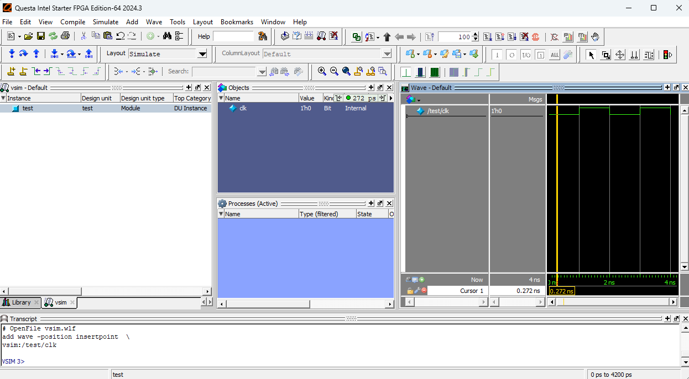

みんな大好き`ModelSim-ASE`の後継版、`Questa-FSE`を試しに使ってみるテスト。リッチなGUIとデバッガがほしいときは、DSimよりもこっちのほうが便利かもしれなくなくもない。

## Questa-Intel FPGA Starter Editionの特徴
- 無償で利用可能。
- ライセンスの取得の手続きがちょっとめんどい。
- 追加ライセンスを必要とする機能は基本的に使えない。

| 機能 | 利用可否 |
|--|--|
| SVA | ✔ OK |
| UVM | ✔ OK |
| 制約付きランダム | ❌ `svverification`が必要 |
| User-defined nettype | ❌ `svrnm`が必要 |
| Visualizer | ❌  `qdebug`が必要 |

## 環境変数の設定とシミュレーションの実行

```dosbatch title="run.bat"
@echo off
set "LM_LICENSE_FILE=\PATH\TO\LR-255400_License.dat"
set "qrun=C:\altera\24.1std\questa_fse\win64\qrun.exe"
cd %~dp0
%qrun% -f options.txt
pause
exit
```

## 波形保存の例

```title="options.txt"
+acc
-do "add log -r *; run -all;"
test.sv
```

```dosbatch title="vsim.bat"
@echo off
set "LM_LICENSE_FILE=\PATH\TO\LR-255400_License.dat"
set "vsimC:\altera\24.1std\questa_fse\win64\vsim.exe"
cd %~dp0
%vsim% vsim.wlf
exit
```

```SystemVerilog title="test.sv"

module test;
  timeunit 1ns;
  timeprecision 1ps;

  bit clk;

  initial begin
    $monitor("clk = %0b", clk);
    repeat(4) begin
      #1ns;
      clk = ~clk;
    end
    $finish();
  end
  
endmodule
```



## UVMテストの例

```title="options.txt"
-do "run -all;"
-uvm
+UVM_NO_RELNOTES
+UVM_TESTNAME=simple_test
top.sv
```

```SystemVerilog title="top.sv"
`include "uvm_macros.svh"

module top
  import uvm_pkg::*;
();
  timeunit 1ns;
  timeprecision 1ps;

  class simple_test extends uvm_test;
    `uvm_component_utils(simple_test)
    
    function new (string name="simple_test", uvm_component parent=null);
      super.new(name, parent);
    endfunction

    task run_phase (uvm_phase phase);
      phase.raise_objection(this);
      `uvm_info(get_type_name(), "Hello", UVM_MEDIUM)
      `uvm_info(get_type_name(), "World", UVM_MEDIUM)
      phase.drop_objection(this);
    endtask
  endclass

  initial begin
    run_test();
  end
  
endmodule
```

```title="Simulation result"
# run -all
# ----------------------------------------------------------------
# UVM-1.1d
# (C) 2007-2013 Mentor Graphics Corporation
# (C) 2007-2013 Cadence Design Systems, Inc.
# (C) 2006-2013 Synopsys, Inc.
# (C) 2011-2013 Cypress Semiconductor Corp.
# ----------------------------------------------------------------
# UVM_INFO C:/altera/24.1std/questa_fse/verilog_src/questa_uvm_pkg-1.2/src/questa_uvm_pkg.sv(277) @ 0: reporter [Questa UVM] QUESTA_UVM-1.2.3
# UVM_INFO C:/altera/24.1std/questa_fse/verilog_src/questa_uvm_pkg-1.2/src/questa_uvm_pkg.sv(278) @ 0: reporter [Questa UVM]  questa_uvm::init(+struct)
# UVM_INFO @ 0: reporter [RNTST] Running test simple_test...
# UVM_INFO top.sv(18) @ 0: uvm_test_top [simple_test] Hello
# UVM_INFO top.sv(19) @ 0: uvm_test_top [simple_test] World
# UVM_INFO C:/altera/24.1std/questa_fse/verilog_src/uvm-1.1d/src/base/uvm_objection.svh(1267) @ 0: reporter [TEST_DONE] 'run' phase is ready to proceed to the 'extract' phase
```