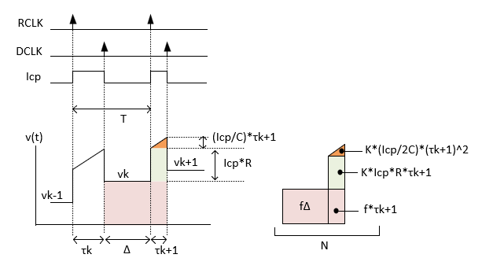
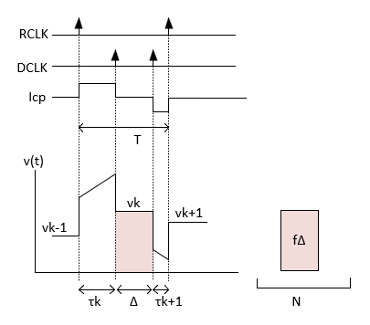
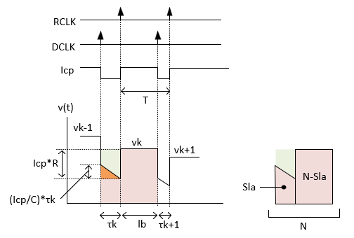
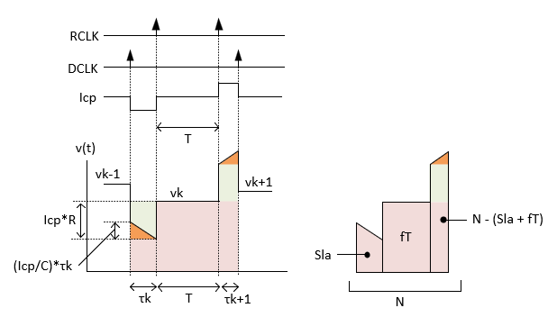

## 元論文

- [Analysis of a charge-pump PLL: a new model (1994)](https://ieeexplore.ieee.org/document/297861)
- [Comment on "Analysis of a Charge-Pump PLL: A New Model" by M. van Paemel  (2019)](https://arxiv.org/abs/1810.02609)

## Corrected Van Paemel model

### Case 1

$\tau(k) \ge 0$ かつ $c \le 0$ のとき、つまり、基準エッジが先行していて、次の基準エッジまでに分周エッジが間に合わない場合。元のVan Paemelの論文におけるCase 1に対応する。

$$
\begin{align}
  \tau(k+1) = \frac{-b+\sqrt{b^2-4ac}}{2a}
\end{align}
$$

### Case 2

$\tau(k) \ge 0$ かつ $c > 0$ のとき、つまり、基準エッジが先行していて、次の基準エッジまでに分周エッジが間に合う場合。元のVan Paemelの論文におけるCase 3に対応する。

$$
\begin{align}
  \tau(k+1) = \frac{N}{f_\text{vco}} - T + (\tau(k) \bmod{T})
\end{align}
$$

### Case 3

$\tau(k) < 0$ かつ $l_b \le T$ のとき、つまり、分周エッジが先行していて、次の基準エッジまでに分周エッジが間に合う場合。元のVan Paemelの論文におけるCase 2に対応する。

$$
\begin{align}
  \tau(k+1) = l_b - T
\end{align}
$$

### Case 4

$\tau(k) < 0$ かつ $l_b > T$ のとき、つまり、分周エッジが先行していて、次の基準エッジまでに分周エッジが間に合わない場合。元のVan Paemelの論文におけるCase 6に対応する。

$$
\begin{align}
  \tau(k+1) = \frac{-b+\sqrt{b^2-4ad}}{2a}
\end{align}
$$

ただし、

$$
\begin{align*}
  &f_\text{vco} = K_\text{vco} v(k) + f_0 \\
  &a = {K_\text{vco} I_\text{cp}}/{2C_1} \\
  &b = f_\text{vco}+ K_\text{vco} I_\text{cp} R_1 \\
  &c = f_\text{vco} (T - (\tau(k) \bmod T))  - N \\
  &l_b = ({N - Sl_a})/{f_\text{vco}} \\
  &Sl_a = Sl_k \bmod N \\
  &Sl_k = -(f_\text{vco} - I_\text{cp} R_1 K_\text{vco})\tau(k) + K_\text{vco} I_\text{cp} {\tau(k)^2}/{2C_1} \\
  &d = Sl_a + f_\text{vco} T - N
\end{align*}
$$

### 電圧の更新式

前述のすべての場合において、

$$
\begin{align}
  v(k+1) = v(k) + \frac{I_\text{cp}}{C_1}\tau(k+1)
\end{align}
$$